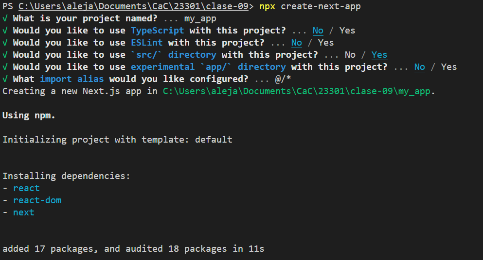

# clase-09
con Framework de NextJS

## Creamos proyecto de React con Next con las siguientes opciones.

## Ejercicio

* Crear un proyecto de React Next, limpiaro por completo(como este ejemplo) y ponerle una imagen de fondo (pantalla completa en el background)